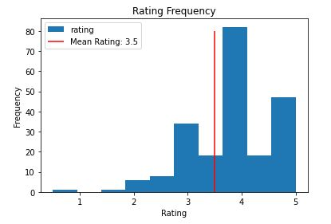

# Phase 4 Project: Recommendation System
**Source:** [MovieLens](https://grouplens.org/datasets/movielens/latest/)
**Author:** Tommy Phung

## Overview 
There are more than millions of movies made since first introduced. The normal person however has limited time to watch movies in their free time more than ever. To help consumers save time and money and companies give consumers the best experience, recommendations are made to make selection easier. To make these recommendations, we will be using a dataset of roughly **10,000 movie entries** to predict that a user would rate a given movie higher than those users with similar reviews on said movie. By comparing similar users and movie ratings, we should be able to recommend movies accurately. 

We attempt to use **memory-based modeling** and **model-based modeling** to fit the training set. **Peterson's similarity** appeared to perform the best for the Memory based models and was used to compare the others. Grid search was also used for both types to find the best combinations for each of the models. The final model used was the KNN Baseline algorithm

Lastly, there were **two ways** to recommend to users the top 5 movies. <br>
**First** was an artificial ranking given by the position and weighing them the user-based model and the item-based model. **The sum of the two ranks is their combined rank and is compared to the others to recommend.** <br>
The **second** way is to take the corresponding rank of the predicted values from the models and take **the average of the ratings from their sum**. The second way appear to be a better prediction than the previous models with a small difference in RSME. 

## Buiness Understanding

There has been a boom in streaming services and thousands of movies for consumers to watch. Netflix has over **4,000 movies** and Prime Video has roughly **7,000 movies** not considering that these big streaming services have their original movies as well. To compete with other streaming platforms, the user experience should be the focus of these companies. <br>
**One aspect to look into is the recommendation system they have on their website that would recommend movies to the users based on their movies, trending movies, and popular movies**. The user experience needs to entice old users to stay and welcome new users to join and begin watching movies. 

Recommendation works well in most cases. On average, better-rated movies perform well and people will actively look for them before making their choice to watch said movie. For example, **70% of videos** watched are made from their recommendations. 

## Data Understanding

The dataset was compiled by the **Grouplens** research group and the source of that data comes [MovieLens](https://movielens.org/). MovieLens is a movie recommendation service that has **9,742 movies** and **100,836 ratings** from **610 users**. The dataset was updated on September 26, 2018. There are three datasets but will only be needing two of them, the ratings and the movies. 

The movie dataset has the movie IDs, titles, and genres for the movie. This was used mainly for conversions but could potentially be used for the genres as it was explored for a bit. 
Ratings have the most pieces of information as it has ratings and timestamps. The ratings were scaled from **0 to 5 with a .5 step**. 


Exploring the datasets have some interesting facts concerning the dataset. For one, the distribution is slightly skewed left with the **mean** rating happening to be roughly **3.5**. There are a handful of users that contributes to the reviews given which may have bias depending on who the user was. **Most movies were not rated below 3** so it might be difficult to determine a good movie to recommend.  



| Labels  | Description                       |
|---------|-----------------------------------|
| MovieId | The identifier for a given movie  |
| UserId  | The identifier for a given user   |
| Ratings | A score between 0 - 5 from a user |
| Genres  | Genres listed for a movie         |
| Titles  | Corresponding title for a MovidId |

## Methods
We used surprise libraries to create a recommendation system using different algorithms. The Memory-Based models are **KnnBasic**, **KnnBaseline**, and **KnnWithMeans**. The Model-based modeling algorithm is **SVD or Singular Value decomposition**. After finding the best base model, a grid search is used to find the best parameters. We also tried to use different similarity conditions to see if that also improves the model. 

## Results
| Model       | RSME  | GridSearch |
|-------------|-------|------------|
| KnnBasic    | .9819 |            |
| KnnWithMean | .9103 |            |
| KnnBaseline | .8883 | **.8753**  |
| SVD         | .8833 | **.8780**  |

There was a slight difference between the Baseline version and the SVD model. KnnBaseline perform slightly better and was used for this project. 


## User Example 1 Recommendation
Example of the model working to provide recommendation based on the user given.
Both of the graphs are from the model's prediction with the watched movies removed. 
Id is still used for readabilty. 

| Weighted Ranks Sum  | Average Ratings Movies |   |
|---------|-------------------|---|
| **'Shawshank Redemption, The (1994)'** | **'Shawshank Redemption, The (1994)'**  |   |
| **'Sunset Blvd. (a.k.a. Sunset Boulevard) (1950)'**  | **'Sunset Blvd. (a.k.a. Sunset Boulevard) (1950)'**   |   |
| **'Dr. Strangelove or: How I Learned to Stop Worrying and Love the Bomb (1964)'** | **'Dr. Strangelove or: How I Learned to Stop Worrying and Love the Bomb (1964)'** |   |
| 'Ghost in the Shell (Kôkaku kidôtai) (1995)' | 'Lord of the Rings: The Fellowship of the Ring, The (2001)' |   |
| 'Wallace & Gromit: The Best of Aardman Animation (1996)'  | 'High Noon (1952)'                            |   |
|     |                                                                                   |   |

**Three of the Five** movies are in both list with the new methods. However, we can show that the average ranks have a **better RSME** than the previous two models.  


## Comparison Analysis
From the predicted ratings for user 1, we can see **a slight difference** in user similarity vs item similarity between movies. Interestingly, the item comparison has all the movies rated above three which goes inside with user 1 trend on rating movies. User 1 doesn't seem so **rate movies lower than three** often and therefore most movies would be rated similarly. Due to the number of users, there is a bigger disparity between users with the movies they watched naturally. 


|            | **Knn_Baseline_user** | **Knn_Baseline_item** | **Combined Rating** |
|------------|:---------------------:|:---------------------:|:-------------------:|
| RSME Score | .8776                 | .8899                 | **.8708**           |

## Limitations
This model isn't without its limitations as several aspects make the model less effective.

1. The distrubition is **skewed to the left** with many of the ratings are higher than 3 with **few rated between 0 - 2.5**. This can be contributed to the fact that many people won't leave reviews unprompted.
2. The model doesn't have anything to combat review bombing which has happened to many movies recently to **negatively impact the movie's performance**. This can be difficult since it's hard to distinguish between actually truthful ratings or not. 
3. There were **many ratings from the same users**. There can be a **bias** between users especially when the majority of the ratings are from them. These users could also be critics that may be very helpful to the average moviegoer. 

## Recommendations
There are also some ways to improve the model that can be added to the project to further the accuracy for users.

1. The movie dataset had genres as a column. A previous project shows that **certain combinations perform better at the box office**. If we can incorporate this in the model and know what the users' favorite genres are. 
2. **More data will improve the model**. There was a bigger dataset that was also created and could be used, with enough time, for a better model. 
3. The data should include more ratings with a **wider range of ratings** from the users. Ideally should be a bell curve depending on if an equal number of bad and good movies are included in the movies list. 

## Repository Structure
```
├── README.md                           <- The top-level README for reviewers of this project
├── main_notebook.ipynb                 <- Narrative documentation of analysis in Jupyter notebook
├── exploration_notebook.ipynb          <- Exploration for the dataset and graphing
├── presentation_4.pdf                  <- PDF version of project presentation
├── pictures                            <- Graphs and plots created by code
├── helper.py                           <- Functions created for the notebook
└── Data                                <- Original dataset from Website
```
